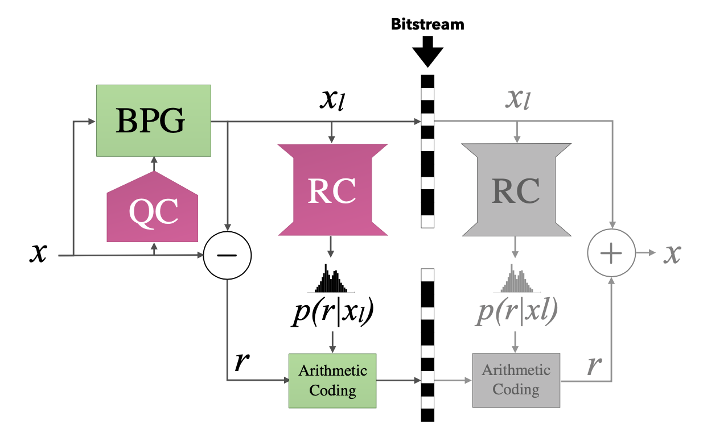

# RC-PyTorch

  

## Learning Better Lossless Compression Using Lossy Compression

## [[Paper]](https://arxiv.org/abs/2003.10184) [[Slides]](https://data.vision.ee.ethz.ch/mentzerf/rc/2008-slides.pdf)

## Abstract

We leverage the powerful lossy image compression algorithm BPG to build a
lossless image compression system. Specifically, the original image is first
decomposed into the lossy reconstruction obtained after compressing it with BPG
and the corresponding residual.  We then model the distribution of the residual
with a convolutional neural network-based probabilistic model that is
conditioned on the BPG reconstruction, and combine it with entropy coding to
losslessly encode the residual. Finally, the image is stored using the
concatenation of the bitstreams produced by BPG and the learned residual coder.
The resulting compression system achieves state-of-the-art performance in
learned lossless full-resolution image compression, outperforming previous
learned approaches as well as PNG, WebP, and JPEG2000.

### Upcoming:

- [ ] Code
- [ ] Datasets
- [ ] Preprocessing
